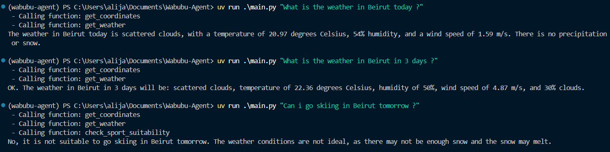

# **Wabubu Agent – Intelligent Weather & Sports Suitability Assistant**

Wabubu is an intelligent AI agent that understands natural language, converts location names into coordinates, retrieves accurate weather data (historical, current, or forecast), and determines whether a sport is suitable to play based on real weather conditions.

Powered by **Gemini**, **OpenWeather**, and **Meteostat**, the agent combines API calls with a custom sport-suitability engine to deliver accurate and helpful responses.

---

## 📸 **Demo Preview**

---

## 🚀 **Features**

### 🌍 Location to Coordinates  
Wabubu converts any place name to accurate latitude & longitude using Nominatim.

### 🌦 Full Weather Intelligence  
Supports:
- **Today’s weather**
- **Tomorrow’s forecast**
- **Future dates up to 5 days**
- **Historical weather for past dates**

Extracts:
- Temperature  
- Wind speed  
- Humidity  
- Clouds  
- Precipitation  
- Snow  

### 🏃 Sports Suitability Engine  
Determines if conditions are safe for sports like:
- Football  
- Running  
- Skiing  
- Tennis  
- Cycling  
- Basketball  
- Hiking  
- Swimming  
- Climbing  
…and more.

The engine checks weather constraints like:
- Min/max temperature  
- Wind limits  
- Humidity  
- Rain amount  
- Snow depth  
- Cloud coverage  

### 🗣 Natural Language Understanding  
Understands phrases like:
- “today”
- “tomorrow”
- “in 3 days”
- “weather in Tyre tomorrow”
- “can I play football in Bazouriye today?”
- “Is it good skiing weather in 3 days?”

---

## 📁 **Project Structure**

Wabubu-Agent/
│
├── functions/
│   ├── get_coordinates.py
│   ├── get_weather.py
│   ├── check_sport_suitability.py
│   └── sports_data.py
├── call_function.py
├── main.py
├── .env
└── README.md

---

## 🛠 Installation

Clone the repository:
git clone https://github.com/your-username/Wabubu-Agent.git
cd Wabubu-Agent

Install dependencies (recommended):
uv sync

---

## 🔑 Environment Variables

Create a `.env` file in the project root:

GEMINI_API_KEY=your_api_key_here
OPENWEATHER_API_KEY=your_api_key_here
METEOSTAT_API_KEY=your_api_key_here

---

## ▶️ Running the Agent

Example queries:
uv run main.py "What is the weather like in Beirut today?"
uv run main.py "Can I play football tomorrow in Tyre?"
uv run main.py "Is it skiing weather in Faraya in 3 days?"

---

## 🧠 How Wabubu Works

The agent analyzes user input and automatically decides which tool(s) to use:

### Tools:
- **get_coordinates(location)** → (lat, lon)
- **get_weather(lat, lon, date)** → weather dictionary
- **check_sport_suitability(sport_name, weather_dict)** → suitability message

The system prompt ensures:
- Automatic date interpretation  
- Correct multi-step reasoning (coordinates → weather → sport check)  
- Natural language flexibility  

---

## 📌 Roadmap

- Add UV index handling  
- Add more sports and custom user-defined sports  
- Add full FastAPI backend for web/mobile integration  
- Add caching layer for repeated weather queries  
- Add CLI color output + GUI version  

---

## 📄 License

MIT License — free for personal and commercial use.

---

## ⭐️ Show Your Support

If you like the project, give it a star on GitHub!

